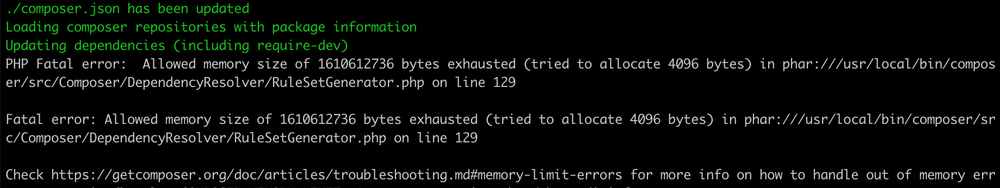

Pernah mengalami error `Composer Memory Limit Errors` saat mencoba menginstall package menggunakan composer?

Kemarin saya mencoba menginstall sebuah package bernama `mhor/php-mediainfo` dan berakhir gagal karena hal tersebut.
Berikut error yang ditampilkan di terminal.
<figure>
  
  <figcaption>Composer Memory Limit Errors</figcaption>
</figure>

Kalau kamu mengalami hal yang sama, solusi yang menururutku paling mudah adalah
```bash
COMPOSER_MEMORY_LIMIT=-1 composer require mhor/php-mediainfo
```

Jadi dengan hanya menambahkan `COMPOSER_MEMORY_LIMIT=-1` di depan command yang akan kita jalankan, masalah bisa teratasi.

Solusi ini saya dapat dari :
- [Composer require runs out of memory. PHP Fatal error: Allowed memory size of 1610612736 bytes exhausted](https://stackoverflow.com/questions/49212475/composer-require-runs-out-of-memory-php-fatal-error-allowed-memory-size-of-161)
- [Composer update memory limit](https://stackoverflow.com/questions/36107400/composer-update-memory-limit)