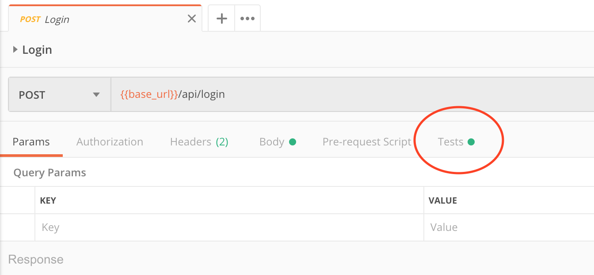
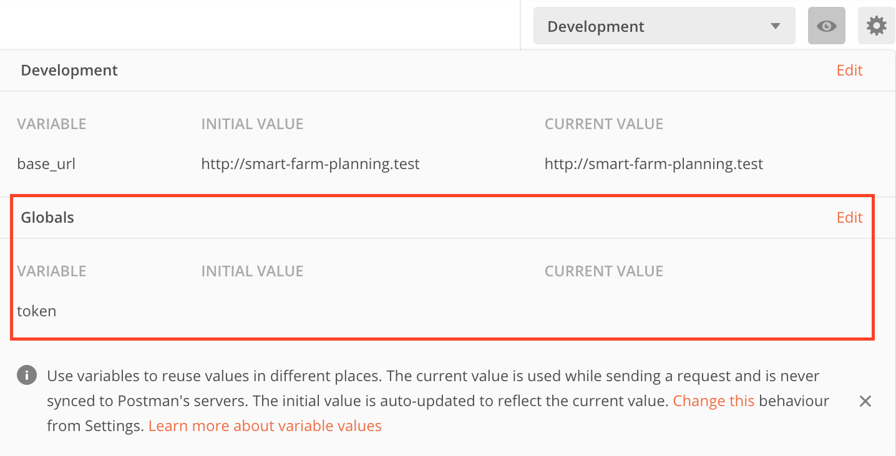
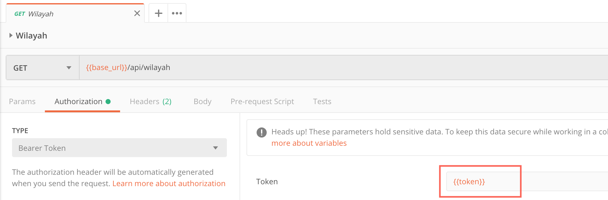

Dalam pembuatan API, saya menggunakan postman untuk melakukan testing request. Akan tetapi, request yang ada biasanya perlu
memasukkan token untuk proses autentikasi. Setelah berdiskusi dengan seorang kawan saat bekerja di jogja dulu, saya baru tahu
kalau postman punya fitur agar proses ini bisa otomatis.
Caranya dengan memanfaatkan tab `tests` yang ada di request.

#### Buka request login seperti gambar di bawah.
<figure>
  
  <figcaption>Request page</figcaption>
</figure>

#### Masukkan test case berikut.
```javascript
var responseJSON = JSON.parse(responseBody);

var user = responseJSON || {};

tests['User has "api_token" property'] = user.data.hasOwnProperty('api_token');

if(tests['User has "api_token" property']){
    pm.globals.set("token", user.data.api_token);
}

tests['Global variable "api_token" has been set'] = pm.globals.get('token') === user.data.api_token;
```

#### Buat global variable dengan nama `token` untuk menyimpan api_token yang didapat setelah login.
<figure>
  
  <figcaption>Add Postman Global Variable</figcaption>
</figure>

#### Buka request lainnya dan update field token di tab Authorization dengan `{{token}}`
<figure>
  
  <figcaption>Update token field</figcaption>
</figure>

That's all. Nilai global variable `token` akan otomatis terupdate setelah kita melakukan hit request `login`. Tidak perlu lagi copy-paste memasukkan nilai token ke dalam request yang akan dipanggil.